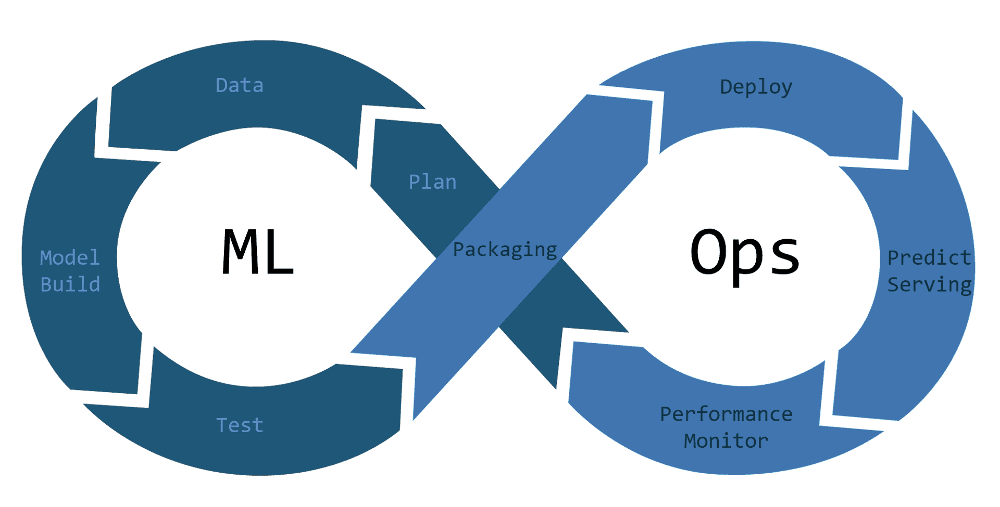

# Apps interactives Streamlit

Une recension d'outils pour construire des applications interactives pour :

- construire des tableaux de bord de Data Science avec une interface de saisie de données et des menus
- exécuter des modèles d'IA avec une interface de saisie de données et des menus,
    - (phase du MLOps : le déploiement du modèle)     
- et bien plus.

## Cas de figure

1. Tableau de bord : Chaine IoT: de Raspberry Pico à un tableau de bord Streamlit via MQTT et MongoDB; consulter le dépôt **chaine_pico_streamlit**. Bouton droit vers : <a href="https://toucan-fortune-streamlit-projet-integrateur-01-accueil-0fsbkp.streamlit.app/M%C3%A9triques" target="_blank">site</a>
1. App d'IA : Machine Learning avec Random Forests; Streamlit; consulter le dépôt **ml_random_forests_streamlit**. Bouton droit vers : <a href="https://ugolabo-ml-random-forests-st-01-modele-widb6v.streamlit.app/" target="_blank">site</a>

| Cas 1  | Cas 2 |
|---|---|
|  |  |

## Équivalences (principales)

Surtout open source, programmées (sans GUI de développement) :

- Applications IA et tableaux de bord de Data Science.
    - **Streamlit** en Python.
    - **FastAPI** en Python.
    - **Gradio** en Python.
    - **Shiny** en R et **Shiny for Python**.
- Tableaux de bord de Data Science.
    - **Dash** de Plotly en Python et R.
    - **Panel** d'HoloViz en Python.
    - **Grafana** en Go et TypeScript.
    - Génerateurs de site web statiques, comme Hugo, avec un thème approprié. Consulter le dépôt : **documentations_web_statiques**.
    - **Quarto** en R, Python et autres langages pour créer des rapports, des articles, des dashboards, des sites web et des blogs. Quarto utilise d'ailleurs Hugo et ses thèmes pour les sites web.
    - Solutions propriétaire plus ou moins programmées, mais surtout avec des GUI de développement : Tableau, Power BI, Qlik, MicroStrategy, MongoDB et autres.
- Cadriciels Python pour construire des sites web.
    - Du simple **Flask** à **Django** plus complet, en passant par **Tornado**.

Le supra-module Python PyCaret pour le Machine Learning est une approche low code. PyCaret est inspiré du module R CARET pour le Machine Learning. Le supra-module invoque les modules de Machine Learning scikit-learn, XGBoost, LightGBM, CatBoost, Optuna, Hyperopt, Ray et d'autres modules. PyCaret peut servir les besoins complets d'un projet de Machine Learning ou servir d'étape préliminaire pour ensuite approfondir le projet avec les options plus avancées du module qu'il a invoqué. PyCaret couvre les principales étapes du MLOps : prétraitement des données, entrainement des modèles, analyse et affinage des modèles, prévisions, sauvegarde et déploiement des modèles. À cette dernière étape, PyCaret automatise la construction d'une app avec :

- <a href="https://pycaret.gitbook.io/docs/get-started/functions/deploy#create_api" target="_blank">FastAPI</a>.
- <a href="https://pycaret.gitbook.io/docs/get-started/functions/deploy#create_app" target="_blank">Gradio</a>.

PyCaret automatise même le déploiement du modèle sur les principaux services cloud.

L'automatisation est pratique en MLOps (CI/CD appliqué au Machine Learning) quand le processus est répété pour des fins d'amélioration continue.

Il n'y a pas d'automatisation avec Streamlit. Il faut récupérer les objets Python sauvegardés comme le scaler et le modèle pour les incorporer à l'app Streamlit. Dans une optique CI/CD, cette approche est moins rapide et plus complexe. L'approche fonctionne aussi avec FastAPI et Gradio afin de personnaliser les apps.

PyCaret automatise aussi la création d'un <a href="https://pycaret.gitbook.io/docs/get-started/functions/deploy#create_docker" target="_blank">conteneur Docker</a>. Consulter le dépôt : **env_empaquetage_docker**.
