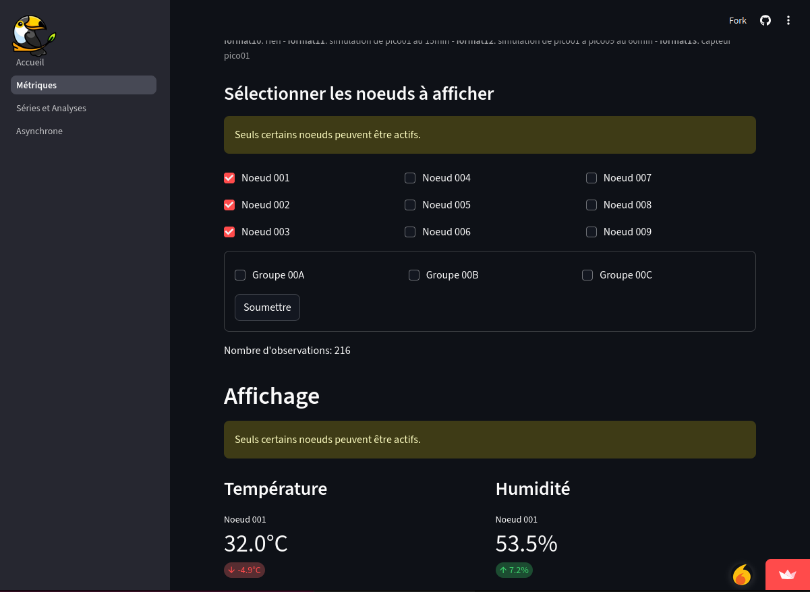

# Apps interactives Streamlit

Une recension d'outils pour construire des applications interactives pour :

- construire des tableaux de bord de Data Science avec une interface de saisie de donnée et des menus
- exécuter des modèles d'IA avec une interface de saisie de données et des menus,
    - (phase du MLOps : le déploiement du modèle)     
- et bien plus.

## Cas de figure

1. Tableau de bord : <a href="https://toucan-fortune-streamlit-projet-integrateur-01-accueil-0fsbkp.streamlit.app/M%C3%A9triques" target="_blank">Chaine IoT: de Raspberry Pico à un tableau de bord Streamlit via MQTT et MongoDB</a>; consulter le dépôt **chaine_pico_streamlit**.
1. App d'IA : <a href="https://ugolabo-ml-random-forests-st-01-modele-widb6v.streamlit.app/" target="_blank">Machine Learning avec Random Forests; Streamlit</a>; consulter le dépôt **ml_random_forests_streamlit**.

| Cas 1  | Cas 2 |
|---|---|
|  |  |

## Équivalences (principales)

Surtout open source, programmées (sans interface graphique de développement).

- Applications IA et tableaux de bord de Data Science.
    - **Streamlit** en Python.
    - **FastAPI** en Python.
    - **Gradio** en Python.
    - **Shiny** en R et **Shiny for Python**.
- Tableaux de bord de Data Science.
    - **Dash** de Plotly en Python et R.
    - **Panel** d'HoloViz en Python.
    - **Grafana** en Go et TypeScript.
    - Génerateurs de site web statiques comme Hugo avec un thème approprié. Consulter le dépôt : **documentations_web_statiques**.
    - **Quarto** en R, Python et autres langages pour créer des rapports, des articles, des dashboards, des sites web et des blogs. Quarto utilise d'ailleurs Hugo et ses thèmes pour les sites web et blogs.
    - Solutions propriétaire plus ou moins programmées, mais surtout avec des interfaces graphiques de développement : Tableau, Power BI, MongoDB, Dashboards, Charts et plus, MicroStrategy, SAP Analytics Cloud, Qlik et autres.
- Cadriciels pour construire des applications IA et des tableaux de bord de Data Science.
    - **Flask**, **Django**, **Tornado** en Python.

Le supra-module Python PyCaret de Machine Learning est une approche low-code. Le supra-module est inspiré du module de Machine Learning CARET de R. Le supra-module pilote les modules de Machine Learning scikit-learn, XGBoost, LightGBM, CatBoost, Optuna, Hyperopt, Ray et plus. PyCaret peut faire un projet complet de Machine Learning ou servir d'étape préliminaire pour ensuite peaufiner le projet avec un module de Machine Learning. PyCaret couvre les principales étapes du MLOps : pré-traitement des données, entrainement des modèles, analyse et affinage des modèles, prévisions, sauvegarde et déploiement des modèls. À la dernière étape, PyCaret automatise la construction d'une app avec :

- <a href="https://pycaret.gitbook.io/docs/get-started/functions/deploy#create_api" target="_blank">FastAPI</a>.
- <a href="https://pycaret.gitbook.io/docs/get-started/functions/deploy#create_app" target="_blank">Gradio</a>.

PyCaret automatise même la publication du modèle et de l'app sur les principaux services cloud. Ce n'est pas le cas avec Streamlit. Donc, il faut récupérer les objets Python comme le scaler et le modèle pour l'incorposer à l'app Streamlit. Cette approche, moins rapide et plus complexe, offre plus de personnalisation. Elle fonctionne aussi avec FastAPI et Gradio.

PyCaret automatise aussi la création d'un <a href="https://pycaret.gitbook.io/docs/get-started/functions/deploy#create_docker" target="_blank">conteneur Docker</a>. Consulter le dépôt : **env_empaquetage_dockers**.
